# Server Monitoring, Logging & CI Pipeline

**Student Name:** Md. Rubaiyat Rahim
**Batch:** DevOps Batch 14  
**Assignment Title:** Server Monitoring, Logging & CI Pipeline

## Project Overview

This project provisions a DevOps environment on an Ubuntu server, utilizing Prometheus for metric scraping, Node Exporter for system-level metrics, Grafana for visualization, Loki/Promtail for centralized logging, and a GitHub Actions self-hosted runner for CI.

## Architecture Diagram

_(Insert diagram image here)_

## Installation Steps & Configuration

At first, created a new EC2 instance as follows:<br/>


<br />Then the following steps were taken.<br />

### 1. Node Exporter Setup

Node Exporter collects system-level metrics (CPU, RAM, Disk, Network) and exposes them on port 9100.

#### 1.1. Download and Extract Binary:

```Bash
wget https://github.com/prometheus/node_exporter/releases/download/v1.7.0/node_exporter-1.7.0.linux-amd64.tar.gz
tar xvfz node_exporter-1.7.0.linux-amd64.tar.gz
sudo mv node_exporter-1.7.0.linux-amd64/node_exporter /usr/local/bin/
rm -rf node_exporter-1.7.0.linux-amd64\*
```

#### 1.2. Create System User:

```Bash
sudo useradd --no-create-home --shell /bin/false node_exporter
```

#### 1.3. Configure Systemd Service:

Create a service file: `sudo nano /etc/systemd/system/node_exporter.service`

```Ini, TOML
[Unit]
Description=Node Exporter
After=network.target

[Service]
User=node_exporter
Group=node_exporter
Type=simple
ExecStart=/usr/local/bin/node_exporter

[Install]
WantedBy=multi-user.target
```

#### 1.4. Start and Verify:

```Bash
sudo systemctl daemon-reload
sudo systemctl enable --now node_exporter
sudo systemctl start node_exporter
sudo systemctl status node_exporter
```

#### 1.5. Add Inbound Rule to Allow Port 9100 from Anywhere


Screenshot Requirement: Open `http://<SERVER_IP>:9100/metrics` in your browser. Take a screenshot showing the exposed metrics.

### 2. Prometheus Setup

Prometheus pulls the metrics exposed by Node Exporter.

#### 2.1. Download and Extract Binary:

```Bash
wget https://github.com/prometheus/prometheus/releases/download/v2.49.1/prometheus-2.49.1.linux-amd64.tar.gz
tar xvfz prometheus-2.49.1.linux-amd64.tar.gz
sudo mv prometheus-2.49.1.linux-amd64/prometheus /usr/local/bin/
sudo mv prometheus-2.49.1.linux-amd64/promtool /usr/local/bin/
```

#### 2.2. Configure Directories and User:

```Bash
sudo useradd --no-create-home --shell /bin/false prometheus
sudo mkdir /etc/prometheus /var/lib/prometheus
sudo mv prometheus-2.49.1.linux-amd64/consoles /etc/prometheus/
sudo mv prometheus-2.49.1.linux-amd64/console_libraries /etc/prometheus/
sudo chown -R prometheus:prometheus /etc/prometheus /var/lib/prometheus
```

#### 2.3. Configure prometheus.yml:

Create the config file: `sudo nano /etc/prometheus/prometheus.yml`

```YAML
global:
  scrape_interval: 15s

scrape_configs:
  - job_name: 'prometheus'
    static_configs:
      - targets: ['localhost:9090']

  - job_name: 'node_exporter'
    static_configs:
      - targets: ['localhost:9100']
```

Change the ownership of this file: `sudo chown prometheus:prometheus /etc/prometheus/prometheus.yml`

#### 2.4. Configure Systemd Service:

Create a service file: `sudo nano /etc/systemd/system/prometheus.service`

```Ini, TOML
[Unit]
Description=Prometheus
Wants=network-online.target
After=network-online.target

[Service]
User=prometheus
Group=prometheus
Type=simple
ExecStart=/usr/local/bin/prometheus \
    --config.file /etc/prometheus/prometheus.yml \
    --storage.tsdb.path /var/lib/prometheus/ \
    --web.console.templates=/etc/prometheus/consoles \
    --web.console.libraries=/etc/prometheus/console_libraries

[Install]
WantedBy=multi-user.target
```

#### 2.5. Start and Verify:

```Bash
sudo systemctl daemon-reload
sudo systemctl start prometheus
sudo systemctl enable --now prometheus
sudo systemctl status prometheus
```

#### 2.6. Add Inbound Rule to Allow Port 9090 from Anywhere


Screenshot Requirements: `Open http://<SERVER_IP>:9090/targets`. Take a screenshot showing Node Exporter as UP. Take another screenshot of the query page showing a metric (e.g., node_cpu_seconds_total).

### 3. Grafana Setup

#### 3.1. Install Grafana Manually:

```Bash
sudo apt-get install -y apt-transport-https wget gnupg
sudo mkdir -p /etc/apt/keyrings
sudo wget -O /etc/apt/keyrings/grafana.asc https://apt.grafana.com/gpg-full.key
sudo chmod 644 /etc/apt/keyrings/grafana.asc
echo "deb [signed-by=/etc/apt/keyrings/grafana.asc] https://apt.grafana.com stable main" | sudo tee -a /etc/apt/sources.list.d/grafana.list
sudo apt-get update
sudo apt-get install grafana
```

#### 3.2. Start Service:

```Bash
sudo systemctl start grafana-server
sudo systemctl enable --now grafana-server
sudo systemctl status grafana-server
```

#### 3.3. Add Inbound Rule to Allow Port 3000 from Anywhere

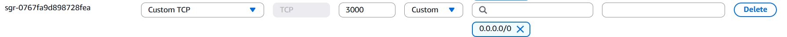

#### 3.4. Configure Datasource and Dashboard:

##### 3.4.1. Open `http://<SERVER_IP>:3000` (Default login: admin / admin).

##### 3.4.2. Go to Connections > Data Sources > Add data source -> Select Prometheus.

##### 3.4.3. Set URL to `http://localhost:9090`, then click Save & Test. (Take a screenshot).

##### 3.4.4. Go to Dashboards > New > Import dashboard. Use Dashboard ID 1860 (Node Exporter Full) to instantly get CPU, RAM, Disk, and Network metrics.

### 4. Loki & Logging

Loki stores the logs, but `promtail` is required to scrape your server logs and send them to Loki.

#### 4.1. Install Loki:

```Bash
curl -O -L "https://github.com/grafana/loki/releases/download/v2.9.4/loki-linux-amd64.zip"
unzip loki-linux-amd64.zip
sudo mv loki-linux-amd64 /usr/local/bin/loki
sudo mkdir -p /etc/loki
```

Create the loki config file: `sudo nano /etc/loki/loki-config.yaml`:

```YAML
auth_enabled: false
server:
  http_listen_port: 3100
common:
  path_prefix: /tmp/loki
  storage:
    filesystem:
      chunks_directory: /tmp/loki/chunks
      rules_directory: /tmp/loki/rules
  replication_factor: 1
  ring:
    instance_addr: 127.0.0.1
    kvstore:
      store: inmemory
schema_config:
  configs:
    - from: 2020-10-24
      store: boltdb-shipper
      object_store: filesystem
      schema: v11
      index:
        prefix: index_
        period: 24h
```

#### 4.2. Install Promtail:

```Bash
curl -O -L "https://github.com/grafana/loki/releases/download/v2.9.4/promtail-linux-amd64.zip"
unzip promtail-linux-amd64.zip
sudo mv promtail-linux-amd64 /usr/local/bin/promtail
sudo mkdir -p /etc/promtail
```

Create the promtail config file: `sudo nano /etc/promtail/promtail-config.yaml`:

```YAML
server:
  http_listen_port: 9080
  grpc_listen_port: 0
positions:
  filename: /tmp/positions.yaml
clients:
  - url: http://localhost:3100/loki/api/v1/push
scrape_configs:
  - job_name: system
    static_configs:
    - targets:
        - localhost
      labels:
        job: varlogs
        __path__: /var/log/*log
```

#### 4.3. Create Systemd Services for Loki & Promtail:

Create the loki service: `sudo nano /etc/systemd/system/loki.service`:

```Ini, TOML
[Unit]
Description=Loki service
After=network.target

[Service]
Type=simple
ExecStart=/usr/local/bin/loki -config.file /etc/loki/loki-config.yaml

[Install]
WantedBy=multi-user.target
```

Create the promtail service: `sudo nano /etc/systemd/system/promtail.service`:

```Ini, TOML
[Unit]
Description=Promtail service
After=network.target

[Service]
Type=simple
ExecStart=/usr/local/bin/promtail -config.file /etc/promtail/promtail-config.yaml

[Install]
WantedBy=multi-user.target
```

Start services:

```Bash
sudo systemctl daemon-reload
sudo systemctl start loki promtail
sudo systemctl enable --now loki promtail
sudo systemctl status loki
sudo systemctl status promtail
```

#### 4.4. Add Inbound Rules to Allow Port 3100 and 9080 from Anywhere

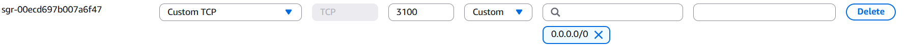
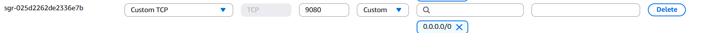

#### 4.5. Verify in Grafana

##### 4.5.1. In Grafana, go to Connections > Data Sources > Add data source -> Select Loki.

##### 4.5.2. Set URL to `http://localhost:3100`. Click Save & Test. (Take a screenshot).

##### 4.5.3. Go to Explore (compass icon), select Loki, run a query like {job="varlogs"}, and click "Run Query". (Take a screenshot).

### 5. GitHub Actions CI

#### 5.1. Configure Self-Hosted Runner:

##### 5.1.1. Go to your GitHub Repository > Settings > Actions > Runners.

##### 5.1.2. Click New self-hosted runner. Select Linux, x64.

##### 5.1.3. SSH into your Ubuntu server and run the exact download/configure commands GitHub provides.

_Download_

```Bash
# Create a folder
mkdir actions-runner && cd actions-runner# Download the latest runner package
curl -o actions-runner-linux-x64-2.337.0.tar.gz -L https://github.com/actions/runner/releases/download/v2.337.0/actions-runner-linux-x64-2.337.0.tar.gz# Optional: Validate the hash
echo "70920811a4f8ad4328818682bca5c6469c1c942fab52448868071d0063816613  actions-runner-linux-x64-2.337.0.tar.gz" | shasum -a 256 -c# Extract the installer
tar xzf ./actions-runner-linux-x64-2.337.0.tar.gz
```

_Configure_

```Bash
# Create the runner and start the configuration experience
./config.sh --url https://github.com/rubaiyatrahim/monitoring-logging-ci --token ADERNOHZJZZWBBJPSJK4MODKXKTJ2# Last step, run it!
./run.sh
```

_Using your self-hosted runner_

```Bash
# Use this YAML in your workflow file for each job
runs-on: self-hosted
```

##### 5.1.4. Run `sudo ./svc.sh install` and `sudo ./svc.sh start` to run it as a background service.

##### 5.1.5. Take a screenshot of the runner showing "Idle" in GitHub.

#### 5.2. Create CI Workflow File:

In your local repository, create the ci pipeline file .github/workflows/ci-pipeline.yml with the following content:

```YAML
name: CI Pipeline

on:
  push:
    branches: [ "main" ]

jobs:
  build-and-test:
    runs-on: self-hosted

    steps:
      - name: Checkout Repository
        uses: actions/checkout@v4

      - name: Setup Node.js (Example Environment)
        uses: actions/setup-node@v4
        with:
          node-version: '20'

      - name: Build Application
        run: |
          echo "Building application..."
          mkdir -p dist
          echo "Build complete." > dist/build.txt

      - name: Test Application
        run: |
          echo "Running tests..."
          echo "All tests passed."

      - name: Upload Artifact
        uses: actions/upload-artifact@v4
        with:
          name: app-build
          path: dist/
```

## CI Pipeline Explanation

The CI pipeline runs on a self-hosted runner. It triggers on a push to `main`, checks out the code, simulates a build step, runs tests, and archives the resulting `/dist` folder using `actions/upload-artifact`.

## Screenshots

### 1. Prometheus

#### Target UP:


#### Metrics Page:

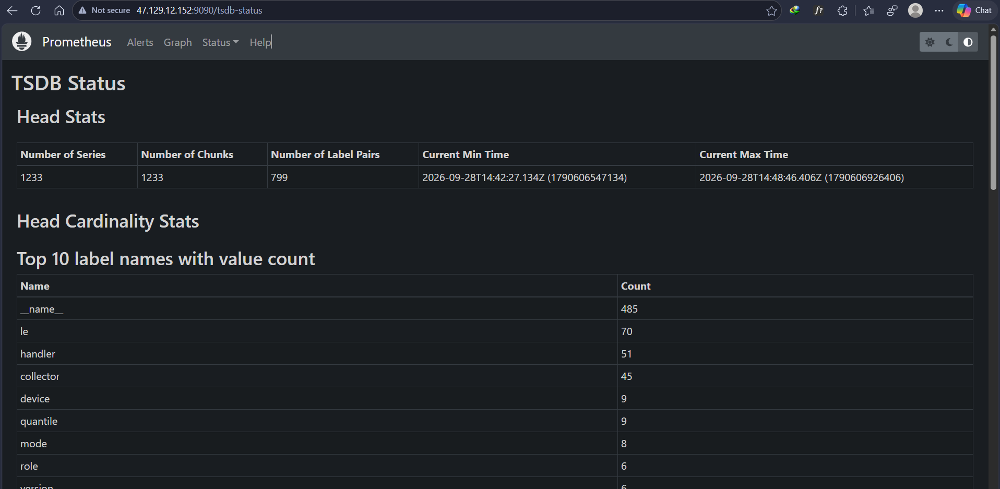


### 2. Node Exporter


### 3. Grafana

#### Grafana Login Page:

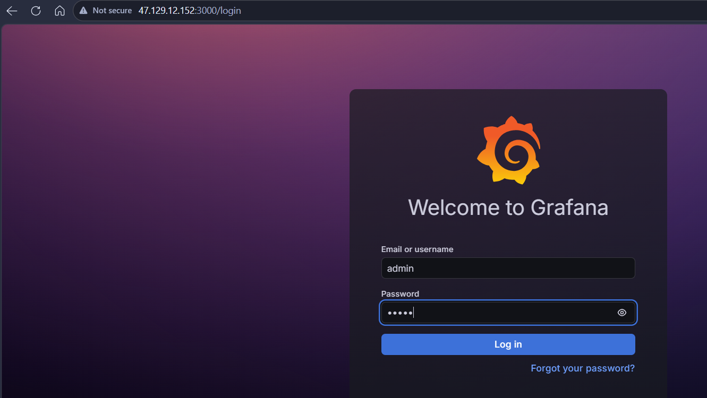

#### Prometheus Datasource Connected:

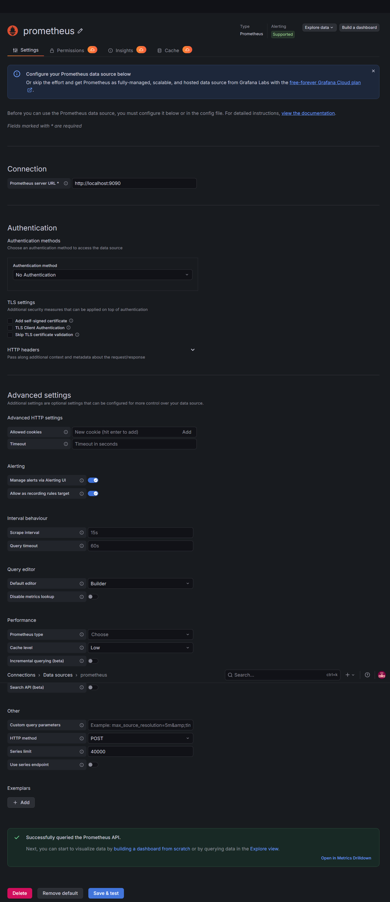

#### Dashboard:

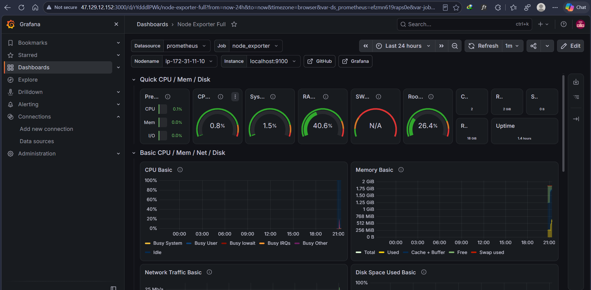

### 4. Loki

#### Loki Datasource Connected:

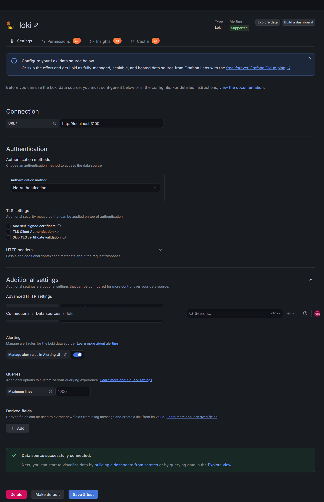

#### Explore page Logs:

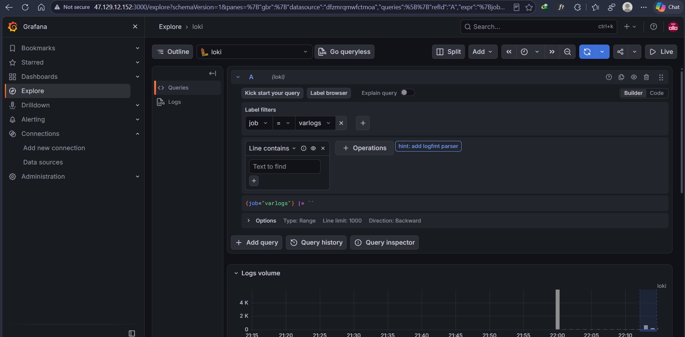
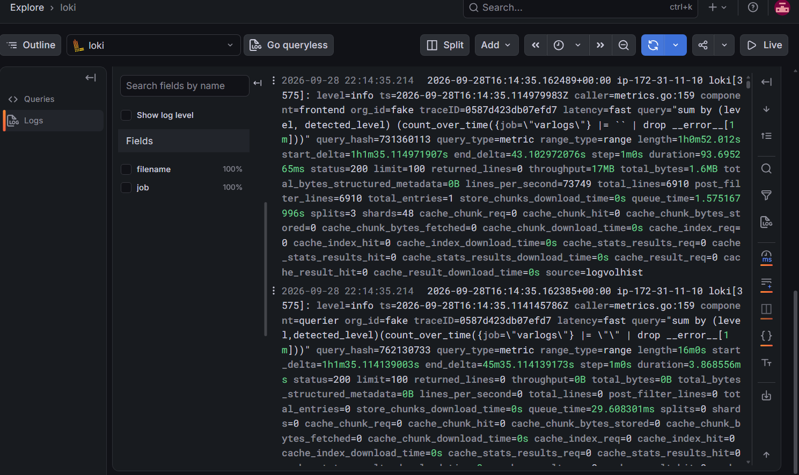

### 5. GitHub Actions

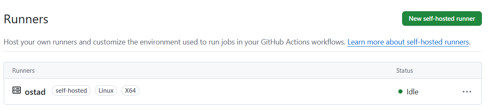
_(Insert Self-hosted runner Online screenshot)_
_(Insert Workflow successful screenshot)_
_(Insert Artifact generated screenshot)_

## Result/Conclusion

Successfully implemented an end-to-end monitoring and logging stack without using Docker, and configured an automated CI pipeline attached to local infrastructure.
