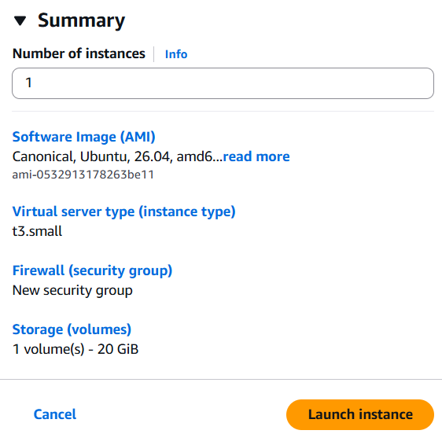
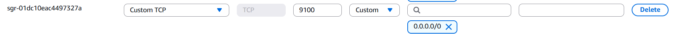
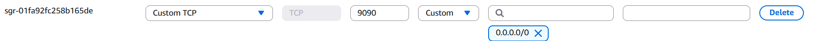
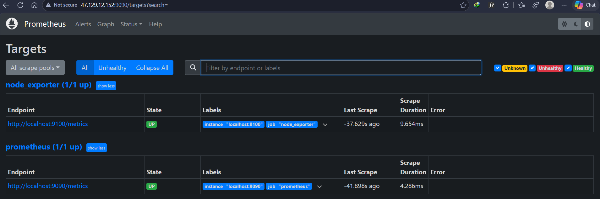
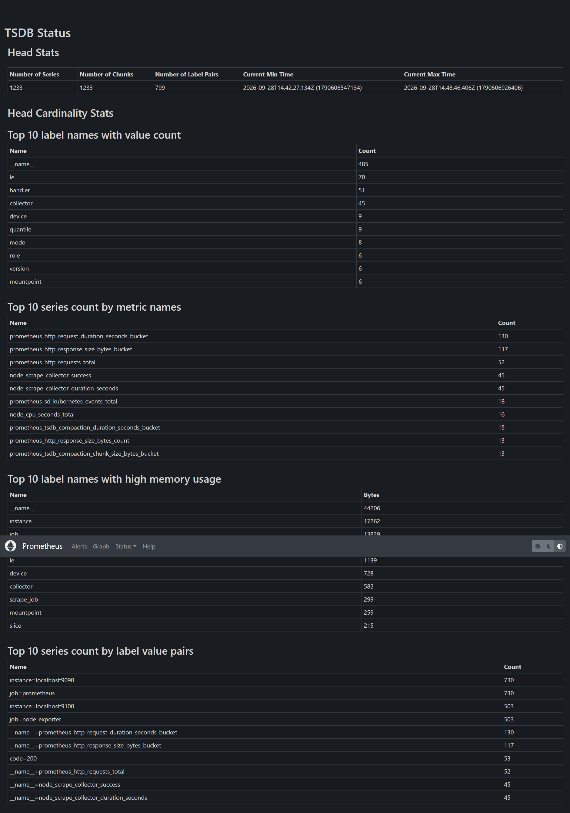
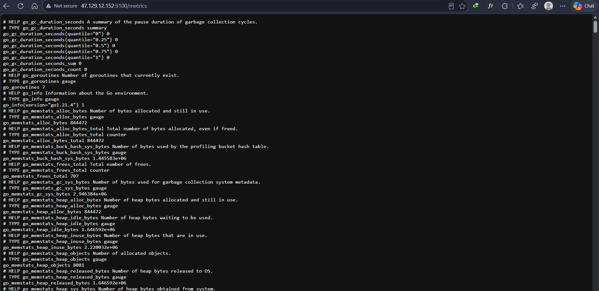

# Server Monitoring, Logging & CI Pipeline

**Student Name:** Md. Rubaiyat Rahim
**Batch:** DevOps Batch 14  
**Assignment Title:** Server Monitoring, Logging & CI Pipeline

## Project Overview

This project provisions a DevOps environment on an Ubuntu server, utilizing Prometheus for metric scraping, Node Exporter for system-level metrics, Grafana for visualization, Loki/Promtail for centralized logging, and a GitHub Actions self-hosted runner for CI.

## Architecture Diagram

_(Insert diagram image here)_

## Installation Steps & Configuration

At first, created a new EC2 instance as follows:<br/>


<br />Then the following steps were taken.<br />

### 1. Node Exporter Setup

Node Exporter collects system-level metrics (CPU, RAM, Disk, Network) and exposes them on port 9100.

#### 1.1. Download and Extract Binary:

```Bash
wget https://github.com/prometheus/node_exporter/releases/download/v1.7.0/node_exporter-1.7.0.linux-amd64.tar.gz
tar xvfz node_exporter-1.7.0.linux-amd64.tar.gz
sudo mv node_exporter-1.7.0.linux-amd64/node_exporter /usr/local/bin/
rm -rf node_exporter-1.7.0.linux-amd64\*
```

#### 1.2. Create System User:

```Bash
sudo useradd --no-create-home --shell /bin/false node_exporter
```

#### 1.3. Configure Systemd Service:

Create a service file: `sudo nano /etc/systemd/system/node_exporter.service`

```Ini, TOML
[Unit]
Description=Node Exporter
After=network.target

[Service]
User=node_exporter
Group=node_exporter
Type=simple
ExecStart=/usr/local/bin/node_exporter

[Install]
WantedBy=multi-user.target
```

#### 1.4. Start and Verify:

```Bash
sudo systemctl daemon-reload
sudo systemctl enable --now node_exporter
sudo systemctl start node_exporter
sudo systemctl status node_exporter
```

#### 1.5. Add Inbound Rule to Allow Port 9100 from Anywhere



Screenshot Requirement: Open `http://<SERVER_IP>:9100/metrics` in your browser. Take a screenshot showing the exposed metrics.

### 2. Prometheus Setup

Prometheus pulls the metrics exposed by Node Exporter.

#### 2.1. Download and Extract Binary:

```Bash
wget https://github.com/prometheus/prometheus/releases/download/v2.49.1/prometheus-2.49.1.linux-amd64.tar.gz
tar xvfz prometheus-2.49.1.linux-amd64.tar.gz
sudo mv prometheus-2.49.1.linux-amd64/prometheus /usr/local/bin/
sudo mv prometheus-2.49.1.linux-amd64/promtool /usr/local/bin/
```

#### 2.2. Configure Directories and User:

```Bash
sudo useradd --no-create-home --shell /bin/false prometheus
sudo mkdir /etc/prometheus /var/lib/prometheus
sudo mv prometheus-2.49.1.linux-amd64/consoles /etc/prometheus/
sudo mv prometheus-2.49.1.linux-amd64/console_libraries /etc/prometheus/
sudo chown -R prometheus:prometheus /etc/prometheus /var/lib/prometheus
```

#### 2.3. Configure prometheus.yml:

Create the config file: `sudo nano /etc/prometheus/prometheus.yml`

```YAML
global:
  scrape_interval: 15s

scrape_configs:
  - job_name: 'prometheus'
    static_configs:
      - targets: ['localhost:9090']

  - job_name: 'node_exporter'
    static_configs:
      - targets: ['localhost:9100']
```

Change the ownership of this file: `sudo chown prometheus:prometheus /etc/prometheus/prometheus.yml`

#### 2.4. Configure Systemd Service:

Create a service file: `sudo nano /etc/systemd/system/prometheus.service`

```Ini, TOML
[Unit]
Description=Prometheus
Wants=network-online.target
After=network-online.target

[Service]
User=prometheus
Group=prometheus
Type=simple
ExecStart=/usr/local/bin/prometheus \
    --config.file /etc/prometheus/prometheus.yml \
    --storage.tsdb.path /var/lib/prometheus/ \
    --web.console.templates=/etc/prometheus/consoles \
    --web.console.libraries=/etc/prometheus/console_libraries

[Install]
WantedBy=multi-user.target
```

#### 2.5. Start and Verify:

```Bash
sudo systemctl daemon-reload
sudo systemctl start prometheus
sudo systemctl enable --now prometheus
sudo systemctl status prometheus
```

#### 2.6. Add Inbound Rule to Allow Port 9090 from Anywhere



Screenshot Requirements: `Open http://<SERVER_IP>:9090/targets`. Take a screenshot showing Node Exporter as UP. Take another screenshot of the query page showing a metric (e.g., node_cpu_seconds_total).

## CI Pipeline Explanation

The CI pipeline runs on a self-hosted runner. It triggers on a push to `main`, checks out the code, simulates a build step, runs tests, and archives the resulting `/dist` folder using `actions/upload-artifact`.

## Screenshots

### 1. Prometheus

#### Targe UP:



#### Metrics Page:




### 2. Node Exporter



### 3. Grafana

_(Insert Prometheus Datasource connected screenshot)_
_(Insert Dashboard screenshot)_

### 4. Loki

_(Insert Loki Datasource connected screenshot)_
_(Insert Explore page logs screenshot)_

### 5. GitHub Actions

_(Insert Self-hosted runner Online screenshot)_
_(Insert Workflow successful screenshot)_
_(Insert Artifact generated screenshot)_

## Result/Conclusion

Successfully implemented an end-to-end monitoring and logging stack without using Docker, and configured an automated CI pipeline attached to local infrastructure.
